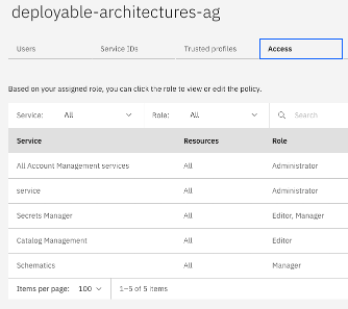

# IBM Cloud Identity and Access Management (IAM) - IBM Cloud deployable architectures
> TLDR -- if you want to provision an IBM Cloud deployable architecture as a non-admin user in your IBM Cloud account, follow these instructions.

To successfully run the IBM Cloud deployable architecture for there are specific Access Groups, Access Group Policies, and base services that need to be present PRIOR to provisioning any deployable architecture (DA).

The intent of these automation assets is to provision the IBM Cloud IAM and base services to prepare an IBM Cloud account for *any* IBM Cloud deployable architecture.

All IBM Cloud deployable architectures must have the conditions met set forth by [Using IBM Cloud deployable architectures to build a deployable architecture](https://cloud.ibm.com/docs/secure-enterprise?topic=secure-enterprise-basic-custom#basic-custom-prereqs)


## What you need to get started
1. An [IBM Cloud account](https://cloud.ibm.com/registration)
2. The [IBM Cloud CLI](https://cloud.ibm.com/docs/cli?topic=cli-getting-started), installed on your local machine
3. A [GitHub](https://github.com/signup) account
4. [Terraform](https://developer.hashicorp.com/terraform/install?product_intent=terraform) installed on your local machine [^1]

### Create the `deployable-architectures-ag` Access group
The following steps ==need only be run 1 time for any and all IBM Cloud deployable architectures.== Once the access group is created, IBM Cloud users can be added or removed from the access group.
1. Open a terminal and login to the IBM Cloud CLI
```ibmcloud login --apikey <YOUR_API_KEY>```
or
```ibmcloud login --sso```

2. Clone this repo
```git clone https://github.com/acmthinks/ibmcloud-iam```

3. Set Terraform variables
```
cd ibmcloud-iam
vi terraform.tfvars
```
Set values and save `terraform.tfvars`
```
ibmcloud_api_key="<your_api_key>"
region = "<ibmcloud_region>"
account_admin_email = "<your_email@company.com>"
```

4. Initialize and run Terraform (review prompts, type 'y')
```
terraform init
terraform plan
terraform apply
```

5. Validate that a new IAM Access group `deployable-architectures-ag` has been created, has Access policies, and has the <account_admin_email> user as a member of the Access group. The access group will look similar to this:


6. Continue to the (/deployable-architectures)[/deployable-architectures] sub-directory and find the specific IBM Cloud deployable architecture to complete the configuration for Access.


[^1]: for those that are concerned about Hashicorp BSL (licensing), you might give [tfswitch](https://tfswitch.warrensbox.com/Installation/), a try. The last release of Hashicorp Terraform prior to BSL is Terraform 1.5.7.
