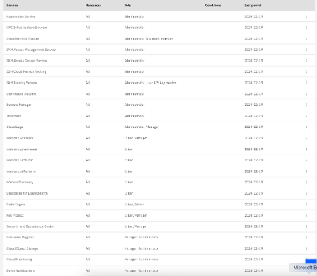

# IBM Cloud Identity and Access Management (IAM) - Retrieval Augmented Generation (RAG) Pattern
> TLDR -- if you want to provision an IBM Cloud deployable architecture as a non-admin user in your IBM Cloud account, follow these instructions.

To successfully run the IBM Cloud deployable architecture for the [Retrieval Augmented Generation (RAG) Pattern](https://cloud.ibm.com/catalog/7a4d68b4-cf8b-40cd-a3d1-f49aff526eb3/architecture/Retrieval_Augmented_Generation_Pattern-5fdd0045-30fc-4013-a8bc-6db9d5447a52-global), there are specific Access Groups, Access Group Policies, and base services that need to be present PRIOR to provisioning the deployable architecture (DA).

## What you need to get started
1. An [IBM Cloud account](https://cloud.ibm.com/registration)
2. The [IBM Cloud CLI](https://cloud.ibm.com/docs/cli?topic=cli-getting-started), installed on your local machine
3. A [GitHub](https://github.com/signup) account
4. [Terraform](https://developer.hashicorp.com/terraform/install?product_intent=terraform) installed on your local machine [^1]
5. Creation of the `deployable-architectures-ag` Access group, per the steps [here](/terraform/README.md)

### Create the `rag-pattern-da-ag` Access group
Once the access group is created, any user that wants to provision this DA should be added to this access group *and* the `deployable-architectures-ag` access group.

1. Open a terminal and login to the IBM Cloud CLI
```ibmcloud login --apikey <YOUR_API_KEY>```
or
```ibmcloud login --sso```

2. Clone this repo
```git clone https://github.com/acmthinks/ibmcloud-iam```

3. Set Terraform variables
```
cd ibmcloud-iam
vi terraform.tfvars
```
Set values and save `terraform.tfvars`
```
ibmcloud_api_key="<your_api_key>"
region = "<ibmcloud_region>"
account_admin_email = "<your_email@company.com>"
```

4. Initialize and run Terraform (review prompts, type 'y')
```
terraform init
terraform plan
terraform apply
```

5. Validate that a new IAM Access group `rag-pattern-da-ag` has been created, has Access policies, and has the <account_admin_email> user as a member of the Access group. The access group will look similar to this:


6. Add all users to the `rag-pattern-da-ag` Access group that should have the ability to provision the [Retrieval Augmented Generation (RAG) Pattern](https://cloud.ibm.com/catalog/7a4d68b4-cf8b-40cd-a3d1-f49aff526eb3/architecture/Retrieval_Augmented_Generation_Pattern-5fdd0045-30fc-4013-a8bc-6db9d5447a52-global) IBM Cloud deployable architecture.

7. Ensure all users in the `rag-pattern-da-ag` Access group are also members of the `deployable-architectures-ag` Access group.

8. All IAM pre-requisites have been configured. All `rag-pattern-da-ag` access group members can go to the IBM Cloud catalog and select the tile for [Retrieval Augmented Generation (RAG) Pattern](https://cloud.ibm.com/catalog/7a4d68b4-cf8b-40cd-a3d1-f49aff526eb3/architecture/Retrieval_Augmented_Generation_Pattern-5fdd0045-30fc-4013-a8bc-6db9d5447a52-global)


[^1]: for those that are concerned about Hashicorp BSL (licensing), you might give [tfswitch](https://tfswitch.warrensbox.com/Installation/), a try. The last release of Hashicorp Terraform prior to BSL is Terraform 1.5.7.
